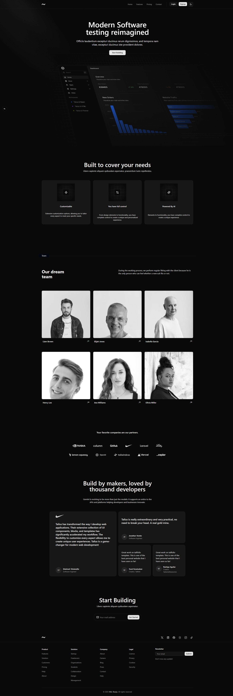
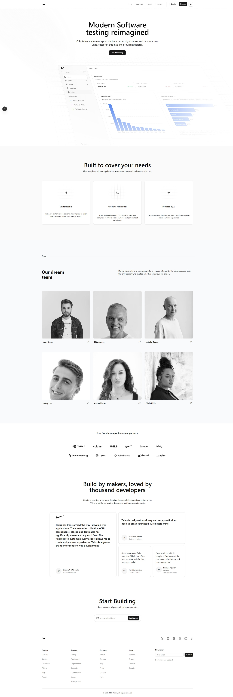

## Next.js Landing Page

## Description

This is a landing page built with Next.js. It is a simple and clean design that showcases the features of Next.js.

## Features

- Responsive design
- Navigation menu
- Contact form
- About page
- Blog page
- 404 page
- Blog post page
- Blog post detail page

## Technologies Used

- Next.js
- Tailwind CSS
- React

## Setup

1. Clone the repository
2. Install dependencies
3. Run the development server

```bash
pnpm install
pnpm run dev
```

## Screenshots



